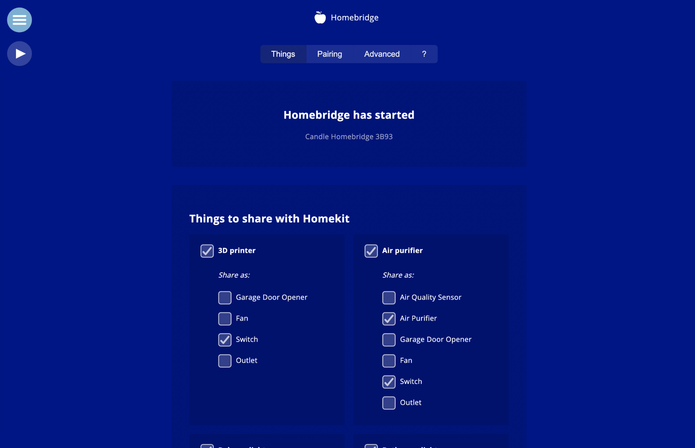
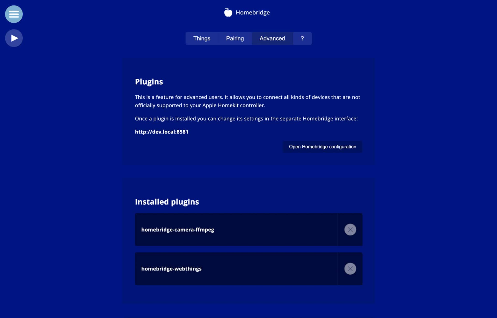

# Homebridge addon

This is an add-on for Candle (a privacy protecting smart home controller) which makes it easier to integrate smart home devices with Apple's Homekit ecosystem. You can select how your devices should be "translated" to Homekit. You can even select multiple types, so a single thing can show up as multiple devices in Homekit.

It also support normal homebridge functionality, such as installing plugins to connect all kinds of devices to Homekit. 

Adding a Raspberry Pi camera is made especially easy - one click. This will show up as a camera or doorbell, depending on some addon settings.

## Privacy features

As a candle creation this addon has extra privacy protecting features. You can (temporarily) limit the preview images of the camera. This does not affect video streaming functionality, but it does limit "accidental glances" while using the Home app. It's part of the goal to limit 'seduction', where users don't intend to spy on each other, but do so accidentally or opportunistically.

## Additional details

The addon installs a Homebridge Plugin that handles the Homekit-Webthings connection and translation. https://github.com/createcandle/homebridge-webthings

## Installation

Install it from the Candle app store.

Learn more at:

https://www.candlesmarthome.com
